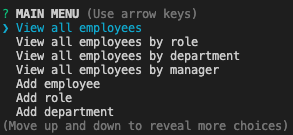

# Employee-Tracker

## Badges

## Description:
This Node application is for a business owner to be able to view and manage departments, roles, and employees in their company in order to organize and plan their business.

The application gives you the following options:

    * View all employees with the option by role, department, or manager
    * Add an employee, role, or department
    * Update an employee role or manager
    * Delete employee, role, or department
    * View department salary budgets

## Table of Contents
* [Description](#description)
* [Installation](#installation)
* [Usage](#usage)
* [Contributing](#contributing)
* [Test](#test)
* [Questions](#questions)
* [License](#license)
* [Author](#Author)
* [Badges](#badges)
## Installation
    1. Run npm install to install all dependencies
    2. Run schema.sql in MySQLWorkbench
    (Optional) Run seeds.sql in MySQLWorkbench
    3. Edit MySQL connection properties in the connectionProperties object in server.js

## Usage
    1. Run node server.js to start the application

    2. Select from the menu to view, add, remove, or update employees, roles, departments, or managers
        

## Contributors
If you would like to contribute to this project please reach out to me on Github or email
## Test
There are no test designed for this application. If you would like to create a test for the application please reach out to me and we can collaborate together.
## Questions
If you have questions about this repository? Please contact me at [kamara.moses@yahoo.com](mailto:kamara.moses@yahoo.com). View more of my work in GitHub at [kamara-moses](https://github.com/kamara-moses).
## License
This repository is licensed under the MIT license.

Copyright (c) [2020] [Moses Kamara]

Permission is hereby granted, free of charge, to any person obtaining a copy of this software and associated documentation files (the 'Software'), to deal in the Software without restriction, including without limitation the rights to use, copy, modify, merge, publish, distribute, sublicense, and/or sell copies of the Software, and to permit persons to whom the Software is furnished to do so, subject to the following conditions:

The above copyright notice and this permission notice shall be included in all copies or substantial portions of the Software.

THE SOFTWARE IS PROVIDED 'AS IS', WITHOUT WARRANTY OF ANY KIND, EXPRESS OR IMPLIED, INCLUDING BUT NOT LIMITED TO THE WARRANTIES OF MERCHANTABILITY, FITNESS FOR A PARTICULAR PURPOSE AND NONINFRINGEMENT. IN NO EVENT SHALL THE AUTHORS OR COPYRIGHT HOLDERS BE LIABLE FOR ANY CLAIM, DAMAGES OR OTHER LIABILITY, WHETHER IN AN ACTION OF CONTRACT, TORT OR OTHERWISE, ARISING FROM, OUT OF OR IN CONNECTION WITH THE SOFTWARE OR THE USE OR OTHER DEALINGS IN THE SOFTWARE.

## Author 

