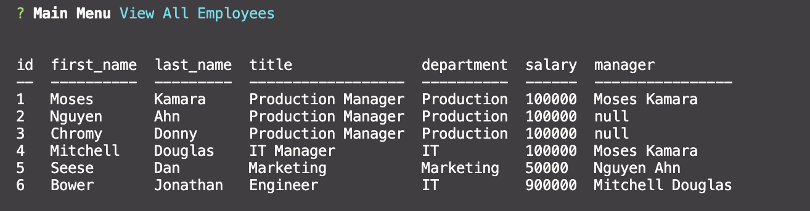

# Employee-Tracker

## Badges

## Description:
This Node application is for a business owner to be able to view and manage departments, roles, and employees in their company in order to organize and plan their business.

The application gives you the following options:

    * View all employees with the option by role, department, or manager
    * Add an employee, role, or department
    * Update an employee role or manager
    * Delete employee, role, or department
    * View department salary budgets

## Table of Contents
* [Description](#description)
* [Installation](#installation)
* [Usage](#usage)
* [Technologies](#technologies)
* [Contributing](#contributing)
* [Test](#test)
* [Questions](#questions)
* [License](#license)
* [Author](#Author)
* [Badges](#badges)
## Installation
    1. Go to https://github.com/kamara-moses/employee-tracker and click on the "Clone or Download" button. 
    2. Choose 'Download ZIP' or 'Clone. 
    3. Unzip into a directory. If you're on Windows, open File Explorer and navigate to the download directory. Select the ZIP file, right click, and choose "Extract All". Accept the default location.
    4. Once the file is unzipped, navigate to employee-tracker-master.
    5. If you don't have the prerequisites installed, type the following:
    * npm install inquirer
    * npm install mysql
    * npm install console-table
    * npm install promise-mysql
    6. Then use your Git terminal to execute server.js.

## Usage

    1. Download and unzip the code, and install the prerequisites, as explained in the "Installing" section of this README.
    2. In your "employee-tracker-master" directory there is a "db" directory. In that directory there are two files: schema.sql and seeds.sql. 
    a. Open your MySQL Workbench and run schema.sql to create the database and tables.
    b. Then run seeds.sql to populate the database with some data.
    3. Now that your database is ready to be queried, open server.js and enter your MySQL root password on line 9.
    4. Open a Git terminal. Type "node server.js".
    5. Select from the menu to view, add, remove, or update employees, roles, departments, or managers

    6. Follow prompt if presented after making a selection from the menu

    7. Exit

## Technologies
    * Git Terminal
    * MySQL
    * Node
        *console.table
        *inqiurer
        *mysql
        *promise-mysql
    * Visual Studio Code

## Contributors
If you would like to contribute to this project please reach out to me on Github or email
## Test
There are no automated test designed for this application. If you would like to create a test for the application please reach out to me and we can collaborate together.

    Used the following manual tests instead:
    1. 'View all employees'
    2. 'View all employees by department'
    3. 'View all employees by role'
    4. 'View all employees by manager'
    5. 'View all departments'
    6. 'View all roles'
    7. "Add department" followed by "View all departments" to confirm that the new departments are added.
    8. "Add role" followed by "View all roles" to confirm.
    9. "Add employee" followed by "View all employees" to confirm that the new employees are added. 
    10. "Update employee role" followed by "View all employees" to confirm.
    11. 'Delete department' followed by 'View all departments' to confirm that the department selected has been deleted.
    12. 'Delete role' followed by 'View all roles' to confirm the role selected has been deleted.
    13. 'Delete employee' followed by 'View all employees' to confirm the employee selected has been deleted
    14. 'View Department Budgets'
    15. 'Exit' exits the application

## Questions
If you have questions about this repository? Please contact me at [kamara.moses@yahoo.com](mailto:kamara.moses@yahoo.com). View more of my work in GitHub at [kamara-moses](https://github.com/kamara-moses).
## License
This repository is licensed under the MIT license.

Copyright (c) [2020] [Moses Kamara]

Permission is hereby granted, free of charge, to any person obtaining a copy of this software and associated documentation files (the 'Software'), to deal in the Software without restriction, including without limitation the rights to use, copy, modify, merge, publish, distribute, sublicense, and/or sell copies of the Software, and to permit persons to whom the Software is furnished to do so, subject to the following conditions:

The above copyright notice and this permission notice shall be included in all copies or substantial portions of the Software.

THE SOFTWARE IS PROVIDED 'AS IS', WITHOUT WARRANTY OF ANY KIND, EXPRESS OR IMPLIED, INCLUDING BUT NOT LIMITED TO THE WARRANTIES OF MERCHANTABILITY, FITNESS FOR A PARTICULAR PURPOSE AND NONINFRINGEMENT. IN NO EVENT SHALL THE AUTHORS OR COPYRIGHT HOLDERS BE LIABLE FOR ANY CLAIM, DAMAGES OR OTHER LIABILITY, WHETHER IN AN ACTION OF CONTRACT, TORT OR OTHERWISE, ARISING FROM, OUT OF OR IN CONNECTION WITH THE SOFTWARE OR THE USE OR OTHER DEALINGS IN THE SOFTWARE.

## Author 

